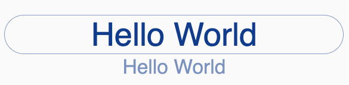
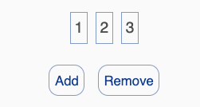

Creating a web application using current development tools can be complicated. The process typically involves multiple technologies (HTML/CSS/JS/SVG) spread over multiple files, a myriad of APIs and dependencies, and a workflow filled with preprocessors, transpilers, and bundlers. Zaffre is an experimental webapp framework which attempts to reduce this complexity by using a single language (Typescript) together with a reactive mechanism that encourages building higher-level abstractions via declarative composition. There are no required runtime dependencies, and the build process is made easy with vite and rollup.
<br/>  
Here's a basic example of a Zaffre component that uses reactive content and styling.
<br/>  

```js
  function HelloWorld1(): View {
    // a reactive value
    const text = atom("Hello World");      
    return VStack({
      padding: core.space.s6,
      maxWidth: ch(120),
    }).append(
      // text input with reactive update on any input
      TextInput(text, {
        rounding: core.rounding.pill,      
        border: core.border.thin,
        textAlign: "center",
        font: core.font.display_medium,
        placeholder: "Enter some text",
      }),
      // text label with reactive style
      TextLabel(text, {                    
        color: core.color.primary,
        opacity: atom(() => zutil.clamp(text.get().length / 20, 0, 1)), 
        font: core.font.headline_medium,
      })
    );
  }
```
<br/>

This produces the following result:
<p align="center"></p>

<details>
  <summary>
See this in action
</summary>

<p align="center"><video src='./assets/HelloWorld1.mp4' controls width="40%" ></p>
</details>
<br/>

A Zaffre *component* is just a function which returns a View object. In this sample, the HelloWorld1 component is defined as a composition of three other components: VStack, TextInput, and TextLabel. The Zaffre rendering process builds the HTML elements and CSS styles dynamically, so no external HTML or CSS files are needed. The reactive text value (an "atom") is shared by the input and label components. When this value is changed by the user in the input field, the label will be updated automatically. This is a kind of reactive content. The opacity of the label is specified as a *derived atom*, which in this case is a function of the text atom. This yields a reactive CSS attribute; that is, the opacity will automatically change when the length of the text value changes.
<br>  
Notes:
<br>
  - Composition is done with the *append()* method.
  - Each component typically takes a list of *options* which result in CSS/HTML/SVG attributes being set on the underlying DOM element.
  - Attributes are often specified using *tokens*. A token is an object that combines with the current *theme* to construct HTML/CSS attributes. 
  - The *core* object contains a collection of predefined tokens for color, font, borders, space, and rounding. These are generally turned into CSS properties when rendered.
  - At the application level, Views are opaque; that is, they are never manipulated directly once they are created. Any varying aspect of a View should be represented in terms of reactive values in the model.
  - Any additional CS/JS files that are needed may be loaded into the DOM dynamically.

<br>  
DOM structure can also be reactive. Below is a simple example.  
<br>
<br>  

```js
  class HelloModel4 {
    counter = 3;
    values = createArrayAtom([1, 2, 3]);
    disabled = atom(() => this.values.length === 1);
    addValue(): void {
      this.values.push(++this.counter);
    }
    removeValue(): void {
      this.values.pop();
    }
  }
  function HelloWorld4(): View {
    const model = new HelloModel4();
    function createLabel(value: number): View {
      return TextLabel(`${value}`, {
        font: core.font.title_medium,
        border: core.border.thin,
        padding: core.space.s2,
      });
    }
    return VStack({ gap: core.space.s5 }).append(
      HStack({ gap: core.space.s4, padding: core.space.s4 }).append(
        List(
          model.values,
          (val) => val,
          (val) => createLabel(val)
        )
      ),
      HStack({ gap: core.space.s5 }).append(
        Button({ label: "Add", action: () => model.addValue() }),
        Button({ label: "Remove", disabled: model.disabled, action: () => model.removeValue() })
      )
    );
  }
```

This produces the following result:

<p align="center"></p>
<br/>

<details>
  <summary>
See this in action
</summary>

<p align="center"><video src='./assets/HelloWorld4.mp4' controls width="40%" ></p>
</details>
<br/>

Each time the "Add" button is clicked, a new value is added to the values list (an *ArrayAtom*), which results in a new label being created and added to the DOM. Likewise, when the Remove button is clicked, a value is removed from the values list, and the label which corresponded to that value is removed because it is no longer in the list.

The key to reactive content is the *List()* function, which returns a *ViewList* rather than a View. A ViewList consists of a reactive array along with a childID function and a childCreator function. As the array changes, the viewList will update the list of children to match the array, preserving children with matching ids.

Some Caveats and Issues
<br>  
- The minimal bundle size is about 100k. 
- Debugging can be challenging; in some cases it can be difficult to understand why particluar actions are not triggered; subtle bugs in derived atom dependencies
- Nesting derived actions, in particular, can result in complex dependencies.
Memory footprint?
- How to prevent circular references?

<br>  
Availability
- Download the Zaffre monorepo at ...
- See the gallery of examples at ...